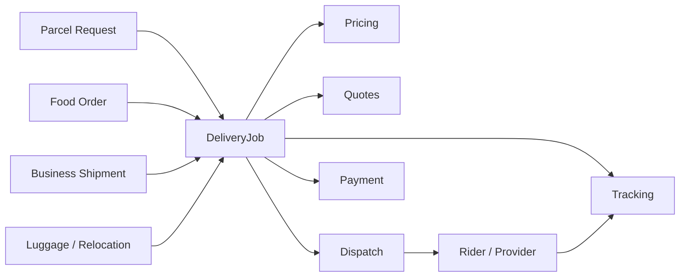
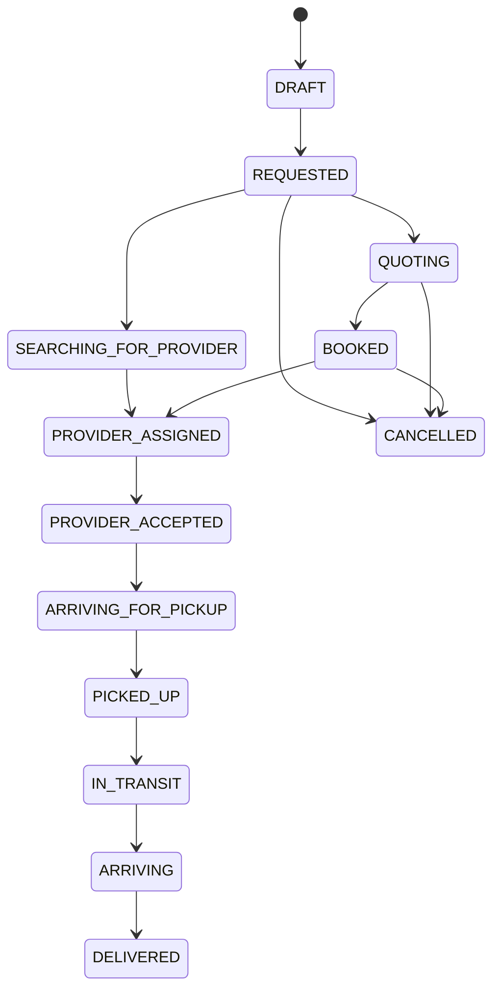
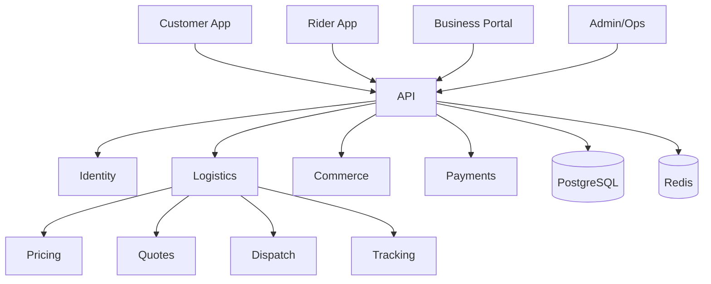

# Suftrip V2 Architecture Baseline

## Product position
Suftrip is a multi-vertical logistics platform. Food delivery is one vertical. Chowdeck is a public benchmark, not a source of proprietary architecture.

## Core model

## Delivery lifecycle

## Platform

These are proposed V2 designs, not claims about current private Suftrip internals.
